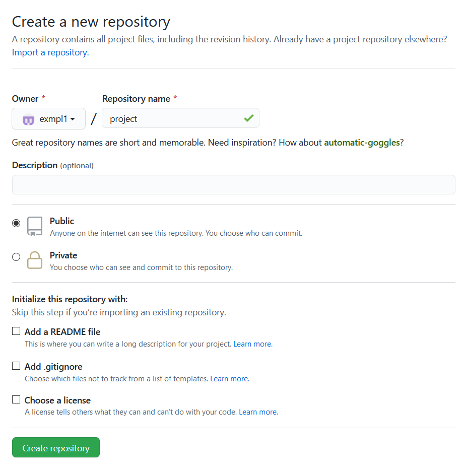

## GitHub

Itse tehtyjen Notebookien jakaminen opiskelijoille onnistuu kätevästi esimerkiksi tallentamalle ne [GitHubiin](https://github.com/), kuten materiaalipankkimme demomateriaalit. Tällä sivulla opastamme GitHubiin rekisteröitymisessä ja alkuun pääsemisessä.

GitHub on suosittu työkalu, joka mahdollistaa muun muassa nettisivujen hostauksen ja koodiprojektien kätevän versionhallinnan silloinkin, kun useampi ihminen muokkaa samaa koodia. Sitä käytetään esimerkiksi ohjelmistojen ja nettisivujen lähdekoodin tallentamiseen. GitHubissa projekteja voi tallentaa repositorioihin eli ohjelmavarastoihin. Julkiseksi määritellyn repositorion sisältämä koodi, tiedostot ja niiden muutoshistoria ovat avoimesti kenen tahansa saatavilla. Tämä tekee materiaalin jakamisesta helppoa, ja kuka tahansa kiinnostunut voi näin perehtyä ohjelmistokoodin toimintaperiaatteisiin. Esimerkiksi [Koronavilkku-sovelluksen lähdekoodi](https://github.com/THLfi) on julkaistu GitHubissa.

GitHubiin rekisteröityminen on ilmaista, ja voit tehdä sen [GitHubin etusivulla](https://github.com/) valitsemalla itsellesi käyttäjänimen ja syöttämällä käyttämäsi sähköpostin sekä haluamasi salasanan.

Tietojen syöttämisen jälkeen sivusto pyytää sinua vahvistamaan tunnuksen luomisen, minkä jälkeen pääset oman GitHubisi etusivulle. Sen pitäisi näyttää suurinpiirtein tältä:

Aloitetaan luomalla uusi repositorio. Tämän voit tehdä oikeasta yläkulmasta löytyvästä painikkeesta. Huomaathan, että ennen kuin voit luoda repositorion, sinun tulee käydä vahvistamassa sähköpostiosoitteesi klikkaamalla vahvistuslinkkiä GitHubin lähettämästä sähköpostista.

Luodessasi repositoriota sen omistajana näkyy käyttäjänimi, jolla olet kirjautunut GitHubiin (esimerkkikuvassa _exmpl1_). Voit valita repositroirolle kuvaavan nimen ja päättää, onko projektisi julkinen vai yksityinen. Jos tarkoituksenasi on jakaa materiaaleja esimerkiksi oppitunneilla, simppeleintä on tehdä repositoriosta julkinen. Tämän lisäksi kannattaa lisätä repositorioon README-tiedosto, jonka sisältö näkyy repositoriosi aloitussivulla ja jonne voit kirjoittaa ohjeita repositorion käyttäjälle. Jos haluat, että muut voivat muokata ja soveltaa avoimia materiaalejasi, kannataa perehtyä repositorioiden [lisensointiin](https://docs.github.com/en/free-pro-team@latest/github/creating-cloning-and-archiving-repositories/licensing-a-repository). Oletuksena GitHubiin ilman erillistä lisenssiä tallennettu materiaali on suojattu tekijänoikeuksin.

Kun olet klikannut painiketta "Create repository", sinulle pitäisi avautua näkymä uuteen repositorioosi:

Wuhuu, ensimmäinen GitHub-repositoriosi on nyt luotu! Pääset luomaan tai lataamaan olemassa olevia tiedostoja klikkaamalla "Add file" ja valitsemalla "Create new file" tai "Upload files". Voit haluteassasi luoda kansion tiedostollesi kirjoittamalla uutta tiedostoa luodessasi sen nimen alkuun haluamasi kansion nimen ja sen perään kauttaviivan / ennen itse tiedoston nimeä.

Sitten vain luomaan Jupyter Notebookeja GitHubiin jaettavaksi!