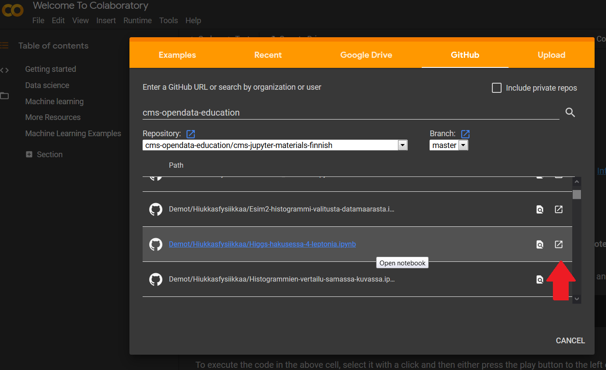
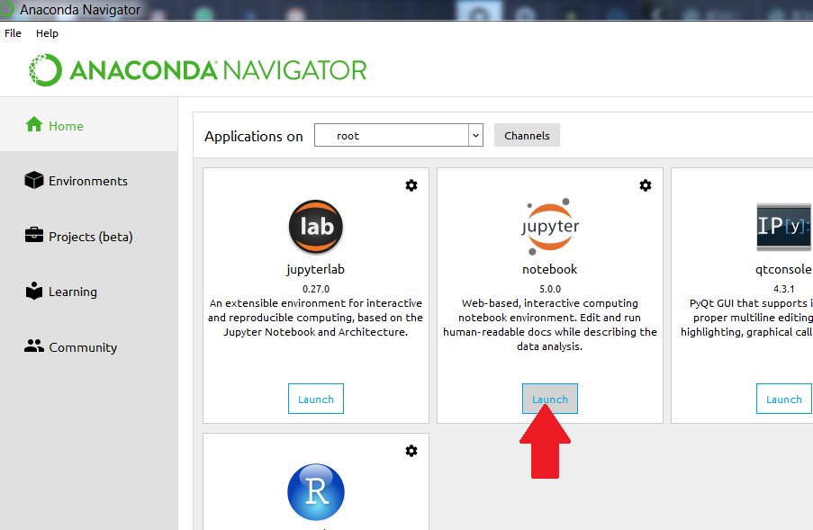

## Jupyter Notebookien käyttöönotto

Jupyter Notebookeja voi käsitellä joko lokaalisti omalta tietokoneeltaan tai verkon yli selaimella virtuaalisella työtasolla.

Selaimessa ajettaessa ei tarvitse tehdä mitään latauksia ja materiaaleihin pääsee yleensä parissa minuutissa käsiksi, mutta tämä vaatii jatkuvaa verkkoyhteyttä
ja on usein aikarajoitettua (MyBinder esimerkiksi irrottaa yhteyden, mikäli materiaaleille ei tehdä mitään reiluun varttiin). Sopii hyvin esimerkiksi demoihin tai intensiiviseen
työpajatoimintaan, mutta pidempiä kotiprojekteja varten kannattaa suosiolla ladata koneelleen sopiva sovellus tätä varten.

### 1. Pikaohje selaimessa avaamiseen

#### MyBinder

I Etsi sopivan muistion tai GitHub-repon osoite, esim. [https://github.com/cms-opendata-education/cms-jupyter-materials-finnish/blob/master/Demot/Hiukkasfysiikkaa/Higgs-hakusessa-4-leptonia.ipynb](https://github.com/cms-opendata-education/cms-jupyter-materials-finnish/blob/master/Demot/Hiukkasfysiikkaa/Higgs-hakusessa-4-leptonia.ipynb)

II Avaa [MyBinder](https://mybinder.org), joka rakentaa virtuaalisen työtilan. Sivu näyttää suunnilleen tältä:

III Kopioi ensimmäisen kohdan osoite kenttiin, joko pelkkä [https://github.com/cms-opendata-education/cms-jupyter-materials-finnish](https://github.com/cms-opendata-education/cms-jupyter-materials-finnish) (rakentaa koko repon ja avaa puurakenteen) tai suoraan tiedostoon paloittelemalla linkki tähän tapaan:

 

IV Paina "launch" ja odota hetki.

V Käy hommiin!

VI Opetushommia ajatellen, huomaa kuvan alaosassa näkyvä valmiiden materiaalien jakolinkki joka on helppoa upottaa verkkosivuille tai viesteihin niin että opiskelijat pääsevät suoraan töihin yhdellä klikkauksella. Esimerkiksi äskeisen harjoitteen saa Binderilla auki tästä HTML-napista painamalla:

#### Google Colab

I Etsi sopiva tiedosto, käytetään samaa kuin yllä (teknisesti haetaan myöhemmin, mutta tietäminen helpottaa löytämistä).

II Avaa [Colab](https://colab.research.google.com/notebooks/intro.ipynb).

III Paina vasemmalta ylhäältä "File"-valikosta "Open Notebook".

IV Avaa "GitHub" -välilehti ja hae haluamaasi repositoriota nimellä.

V Etsi listasta haluamasi tiedosto ja paina avausnappia oikealla:

VI Käy hommiin!
  
VII Sama juttu pikalinkkien kanssa, Colabiinkin voi viitata suoraan yhdellä klikkauksella:

### 2. Pikaohje omalla koneella toimimiseen

I Asenna koneellesi sopiva sovellus, kuten itse [Jupyter Notebook](https://jupyter.org/) tai laajempi datatieteen paketti kuten [Anaconda](https://www.anaconda.com/products/individual), jossa on aiempi mukana.

II Avaa äskeinen (Anacondan tapauksessa löytynee nimellä Anaconda Navigator).

III Valitse "Jupyter Notebook", joka avaa verkkoselaimeesi koneesi paikallisen puurakenteen. 

IV Etsi tiedostoistasi haluamasi muistio ja käy töihin.

V Jos haluat tehdä uusia muistioita, navigoi itsesi puussa kansioon johon haluat tehdä uuden tiedoston ja paina "New" nappia.

